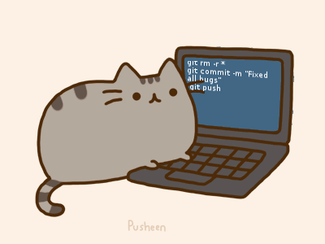

# 👋 Hi, I'm Kevin Castro

***

## About Me

I'm a **Computer Engineering student** interested in understanding software .

I enjoy **backend development**, **web technologies**, and building systems where logic, performance, and design decisions actually matter.  

I'm also curious about **game development** and **low-level / embedded systems**, and I plan to explore those areas as I grow as an engineer.

  

---

## What I Like
- Backend development and system logic  
- Algorithms and problem solving  
- Understanding performance and memory usage  
- Designing systems, not just writing code  
- Learning by building small projects

---

## What I Want to Learn
- Backend architectures and APIs  
- Modern web development  
- Game development with Unity  
- Embedded systems and microcontrollers  
- Low-level concepts closer to the hardware  

---

## Tools I’m Using / Learning

---

##  Current Goal
Build a strong foundation in **software engineering and systems**,  
learn by doing, and gradually move toward **backend, game development, and embedded technologies**.

---

